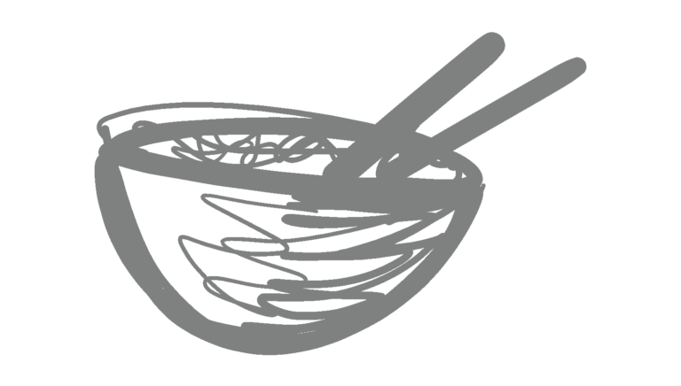
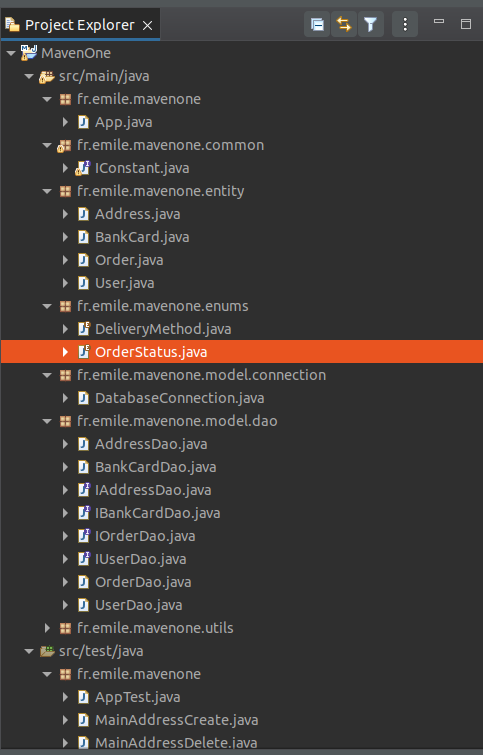

# seedcol
sam. 06 mai 2023 11:01:24 CEST
seedcol
   
    
# Installation     
1. Cloner le repository     
# Qu'il a t-il sous le capot ?     
1. [Java jdk-8u202-linux-x64](https://www.oracle.com/java/technologies/javase/javase8-archive-downloads.html)
1. [apache maven project](https://maven.apache.org/)
1. [Mysql](https://www.mysql.com/fr/)
# Organisation du code     
     
1. /src/main/java/fr/emile/cells/Main.java : Point d'entrée de l'application    
1. /src/main/java/fr/emile/cells/entity/: Les Pojos et beans     
1. /src/main/java/fr/emile/cells/common/: Les constantes commun au projet     
1. /src/main/java/fr/emile/cells/entity/: Les Pojos et beans      
1. /src/main/java/fr/emile/cells/enums/: Les types enumérés      
1. /src/main/java/fr/emile/cells/model/connection: Les connexions vers l'extérieur     
1. /src/main/java/fr/emile/cells/model/dao: Les class d'acces aux bases de données     
1. /src/main/java/fr/emile/cells/utils: Les class utilitaires     
1. /src/main/resources/ Les fichiers de ressources      
1. /src/test/java/fr/emile/cells/ Les class de tests unitaire     
